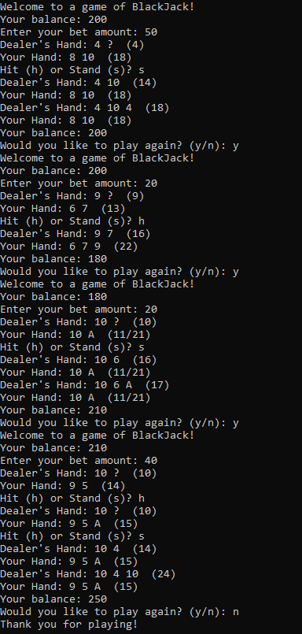
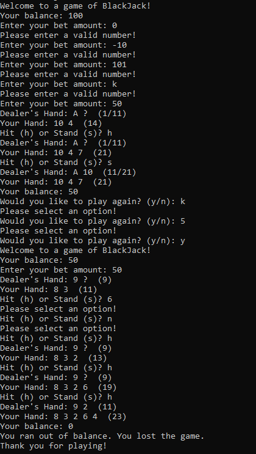

# x86Assembly-Blackjack (NASM)

A fully functional Blackjack game written in bare-metal x86 Assembly (NASM) for 32-bit Linux — no libraries, no runtime, just syscalls.

<p align="center">
  
  &nbsp;&nbsp;&nbsp;&nbsp;
  
</p>

---

## Features

- **Complete Blackjack rules** — Hit, Stand, Natural Blackjack (3:2 payout), Six-Card Charlie, Push
- **Ace soft/hard handling** — displayed as `(1/11)` during play, automatically resolved on bust
- **Dealer AI** — stands on hard 17+, draws on soft 17 (standard casino rules)
- **Bet validation** — rejects invalid input, zero bets, and bets exceeding current balance with overflow protection
- **Balance tracking** — starts at $100, persists across rounds until game over
- **Replay loop** — ask to play again after each round; exits cleanly when balance hits $0
- **Zero dependencies** — no libc, no external libraries; linked directly as a static ELF32 binary

---

## How to Build

```bash
nasm -f elf32 blackjack.asm -o blackjack.o
ld -m elf_i386 blackjack.o -o blackjack
```

Requires `nasm` and GNU `ld`. Tested on x86 and x86_64 Linux (via 32-bit syscall ABI).

---

## How to Play

```bash
./blackjack
```

| Input | Action         |
|-------|----------------|
| `h`   | Hit            |
| `s`   | Stand          |
| `y`   | Play again     |
| `n`   | Quit           |

Uppercase inputs (`H`, `S`, `Y`, `N`) are accepted as well.

---

## Game Rules

- **Natural Blackjack** — 21 with exactly 2 cards pays **3:2**
- **Six-Card Charlie** — reaching 21 or under with 6 cards is an automatic win
- **Push** — tie goes to neither player; bet is returned
- **Dealer Natural** — beats all non-natural player hands regardless of score
- Dealer must draw below 17, stand on 17 and above

---

## Technical Notes

Written entirely in x86 NASM assembly targeting the Linux i386 syscall ABI (`int 0x80`).

- **No stack frames** — function calls use `pushad`/`popad` convention throughout
- **Integer arithmetic only** — 3:2 natural payout computed as `floor(3*bet/2)` via integer ops
- **Overflow-safe bet parsing** — input validated digit-by-digit against `money / 10` and `money % 10` to prevent integer overflow without any 64-bit arithmetic
- **Randomness via RDTSC** — cards drawn using the timestamp counter modulo 52 with collision retry; deterministic but sufficient for a terminal game
- **Ace adjustment loop** — `calculate_score` reduces aces from 11 to 1 iteratively until score ≤ 21 or no aces remain

---

## Planned

- [ ] Full TUI with ANSI escape sequences (alternate screen, raw mode, cursor positioning)
- [ ] ASCII art card rendering with slide-in animation
- [ ] Arrow key + Enter navigation alongside keyboard shortcuts
- [ ] PC speaker sound effects via `KIOCSOUND` ioctl
- [ ] Tracker-style background music (no external audio library)
- [ ] Settings screen (sound toggle, language)
- [ ] Round history log panel
- [ ] How to Play screen

---

## Platform

| Item        | Detail                        |
|-------------|-------------------------------|
| Architecture | x86 (IA-32)                  |
| Format      | ELF32 static binary           |
| OS          | Linux (32-bit syscall ABI)    |
| Assembler   | NASM                          |
| Linker      | GNU ld (`-m elf_i386`)        |
